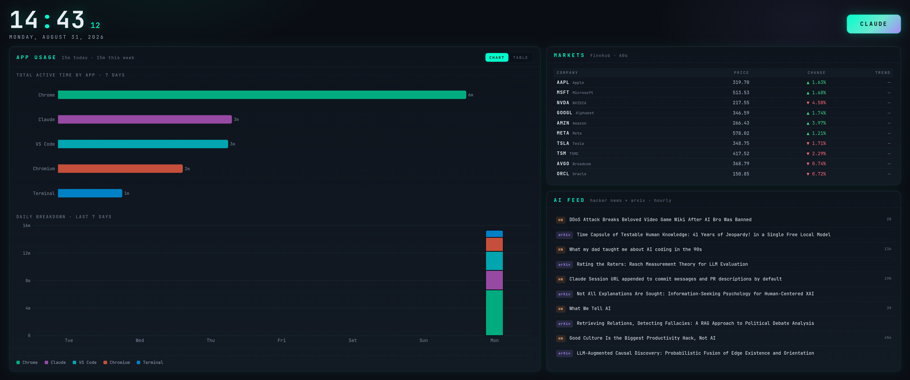

# home-dashboard

A personal desktop dashboard for Kali Linux, built to run 24/7 pinned to the
desktop as a frameless Chromium app window.



- **App usage** — 7 days of per-application active time from ActivityWatch
- **Markets** — the ten largest US tech companies, via Finnhub
- **AI feed** — Hacker News (AI-filtered) + the arXiv `cs.AI` RSS feed
- **Claude** — a launcher button for Claude Desktop

Backend: Flask on `:5000`. Frontend: React + Vite on `:3300`.

> **Why :3300 and not :3000?** Port 3000 on this machine is already taken by the
> `ursGAL` backend. To move the dashboard back to 3000, change the port in
> `frontend/vite.config.js`, `systemd/dashboard-frontend.service`, and
> `start.sh` — or just run with `DASHBOARD_PORT=3000 ./start.sh`.

---

## 1. Requirements

- Python 3.11+, Node 18+, and `chromium` (all present on stock Kali)
- ActivityWatch (see below) for the usage card
- A free Finnhub API key for the markets card

## 2. Install

```bash
cd ~/home-dashboard

# backend
python3 -m venv backend/venv
backend/venv/bin/pip install -r backend/requirements.txt

# frontend
cd frontend && npm install && cd ..
```

## 3. The Finnhub API key

1. Register at <https://finnhub.io/register> — the free tier is enough
   (60 calls/minute; the dashboard uses 10 per minute).
2. Copy your key from the dashboard at <https://finnhub.io/dashboard>.
3. Put it in `backend/.env`:

```bash
cp backend/.env.example backend/.env
$EDITOR backend/.env      # set FINNHUB_API_KEY=...
chmod 600 backend/.env
```

`backend/.env` is listed in `.gitignore` and is the only place the key lives —
it is never committed and never sent to the frontend.

> The free tier does **not** include `/stock/candle`, so the sparklines are built
> from the prices the backend observes while it runs (cached in
> `backend/.cache/price_history.json`). They start as a flat dash and fill in
> over the first hour.

## 4. ActivityWatch

Download the Linux build from <https://activitywatch.net/downloads/> and unzip
it into your home directory:

```bash
unzip ~/Downloads/activitywatch-v0.13.2-linux-x86_64.zip -d ~/
```

That gives `~/activitywatch/` with `aw-server`, `aw-watcher-window` and
`aw-watcher-afk`. The units in `systemd/` run those three directly (rather than
the `aw-qt` tray app), which is what you want for an always-on machine.

The window watcher needs X11 and `xprop` (`apt install x11-utils`), and reads
`DISPLAY=:0` — adjust that in `systemd/aw-watcher-window.service` if your
session uses a different display.

Data lives in `~/.local/share/activitywatch/`. Nothing leaves the machine.

## 5. Run it

```bash
./start.sh
```

This brings up ActivityWatch, the backend and the frontend (skipping anything
already running), then opens Chromium fullscreen in app mode.

### Which monitor

By default the window is pinned to **HDMI-1**. Override it per run:

```bash
DASHBOARD_MONITOR=eDP-1 ./start.sh
```

`start.sh` reads the output's geometry from `xrandr` and passes it to Chromium.
If the named output is not attached it falls back to the primary output (then to
the first connected one) and says so. Chromium remembers its last window
placement inside `~/.config/home-dashboard-chromium`, so if it ever reopens on
the wrong screen the script nudges it back with `xdotool`.

Above 2400px wide the UI scales up (`zoom: 1.45`) so it stays readable on an
ultrawide instead of leaving small text stranded.

## 6. Run on login (systemd)

```bash
cp systemd/*.service ~/.config/systemd/user/
systemctl --user daemon-reload
systemctl --user enable --now \
  activitywatch.service aw-watcher-window.service aw-watcher-afk.service \
  dashboard-backend.service dashboard-frontend.service
```

To keep the services running when you are not logged in graphically:

```bash
loginctl enable-linger "$USER"
```

Useful commands:

```bash
systemctl --user status dashboard-backend.service
journalctl --user -u dashboard-backend.service -f
systemctl --user restart dashboard-frontend.service
```

### Opening the window on login

The systemd units above start the *services*; they do not open the window. That
is a desktop-session job, so it ships as an autostart entry:

```bash
mkdir -p ~/.config/autostart
cp autostart/home-dashboard.desktop ~/.config/autostart/
```

It appears in **Settings → Session and Startup → Application Autostart** as
"Home Dashboard", where you can untick it without deleting anything.

The entry sleeps 8 seconds before running `start.sh`, so the XFCE panel and the
monitor layout are up and `xrandr` reports the real geometry before the window
is placed. `Exec` holds an absolute path - edit it if you move the project.

Running `start.sh` when a dashboard window is already open just focuses the
existing one, so autostart plus a manual run will not leave you with two.

## 7. API

| Endpoint | Cache | Returns |
|---|---|---|
| `GET /api/health` | — | backend status, whether the Finnhub key is set |
| `GET /api/usage` | 30s | per-app totals for today and each of the last 7 days |
| `GET /api/stocks` | 60s | price, change %, previous close, sparkline |
| `GET /api/ai-news` | 1h | top 10 AI items with title, source, URL |
| `POST /api/launch/claude` | — | starts Claude Desktop |

Every GET replies `200` with an `{"available": true|false}` envelope. When an
upstream is down the endpoint returns `available: false` with an `error` and a
`hint`, and the matching card shows a "no data" state — the dashboard never
crashes because ActivityWatch or the internet went away. If a refresh fails but
an earlier result is cached, the cached value is served with `"stale": true`.

The Claude button tries `claude-desktop` first, then
`flatpak run com.anthropic.ClaudeDesktop`, and reports a JSON error if neither
is installed.

## 8. Troubleshooting

| Symptom | Fix |
|---|---|
| Usage card: "ActivityWatch is not reachable" | `systemctl --user start activitywatch.service`; check `curl localhost:5600/api/0/info` |
| Usage card: "No activity recorded yet" | The watchers only just started — events appear within a minute |
| Subtitle says "AFK filter off" | The AFK watcher has no events yet, so idle time is not being subtracted. It corrects itself once `aw-watcher-afk` records its first event |
| Markets: "FINNHUB_API_KEY is not set" | Add the key to `backend/.env` and restart the backend |
| Markets: rate limit | Free tier is 60 calls/min; the 60s cache keeps usage at 10 |
| Frontend won't start | Port in use — `ss -ltnp \| grep 3300`, or set `DASHBOARD_PORT` |

## 9. Layout

```
+-------------------------------------------------------------+
|  14:24  MONDAY, AUGUST 31, 2026                   [ CLAUDE ] |
+---------------------------------+---------------------------+
|                                 |  MARKETS                  |
|  APP USAGE      [chart|table]   |  AAPL Apple  319.70 +1.63% |
|   - total active time by app    |  ...                      |
|   - daily breakdown, 7 days     +---------------------------+
|                                 |  AI FEED                  |
|            60%                  |          40%              |
+---------------------------------+---------------------------+
```

Chart colors are not arbitrary: the eight series slots were generated for the
`#0a0e14` surface and checked with a palette validator (lightness band, chroma
floor, colour-blind separation, contrast). The neon `#00ffcc` / `#a78bfa`
accents are reserved for chrome — they are too light to be readable as fills.
Each app keeps its colour across refreshes (stored in `localStorage`), so
"VS Code is purple" stays true even as the ranking changes. See the comment at
the top of `frontend/src/theme.js` before changing a slot.
